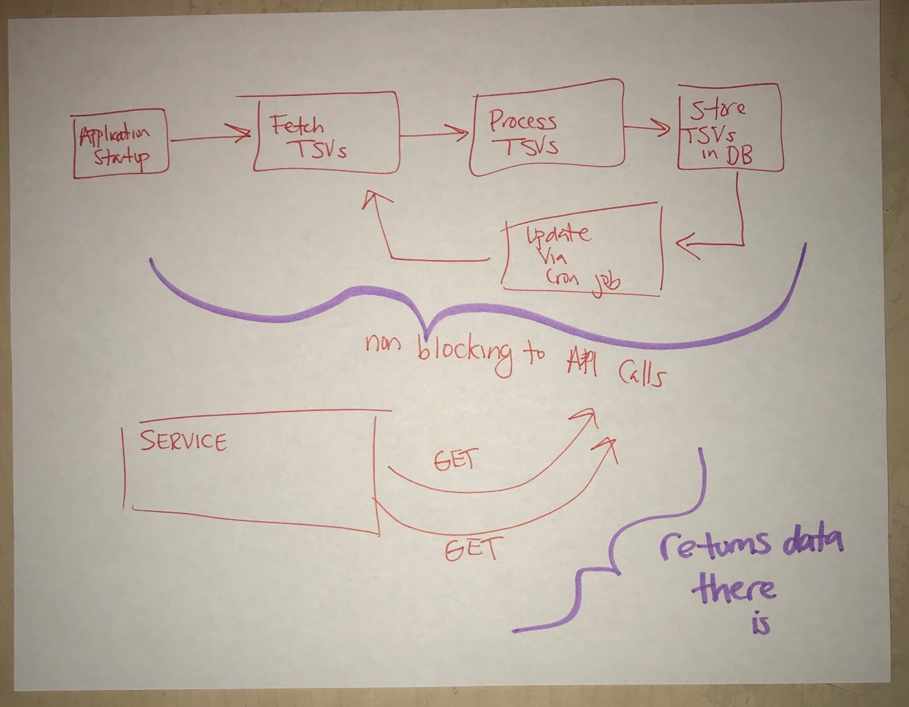
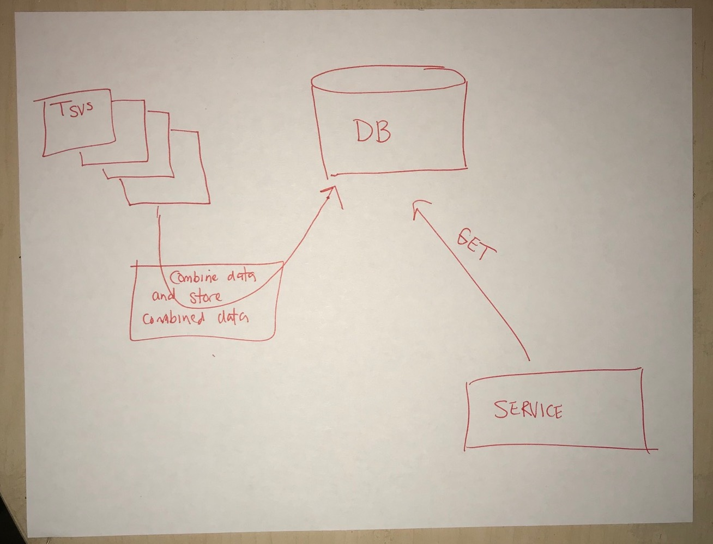
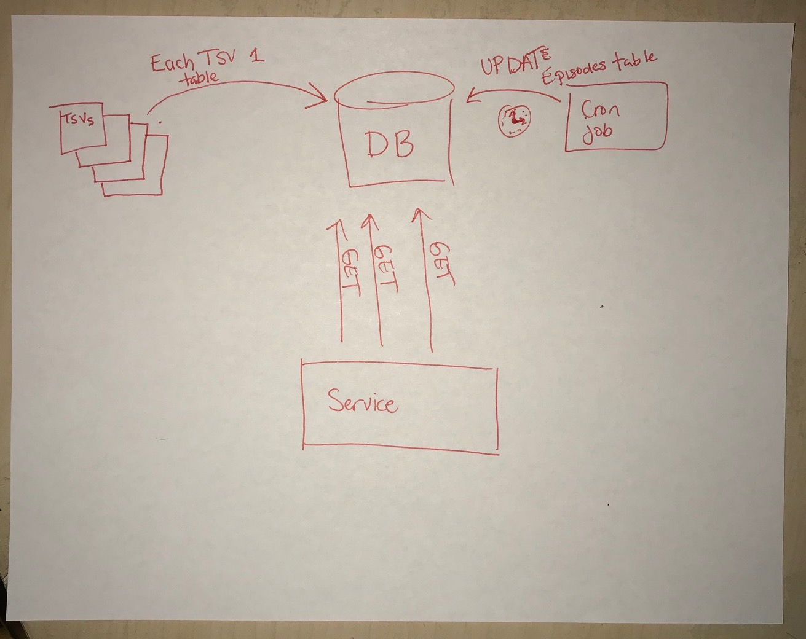
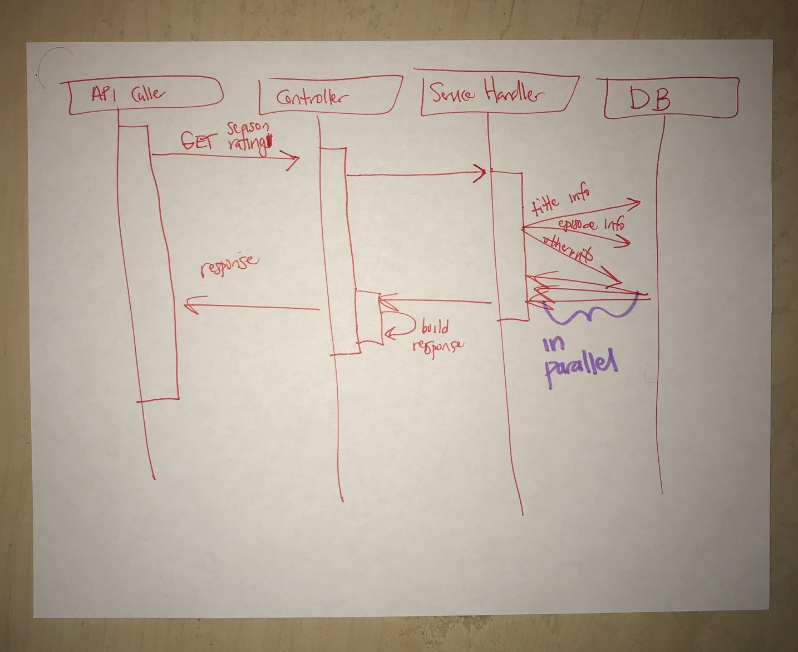
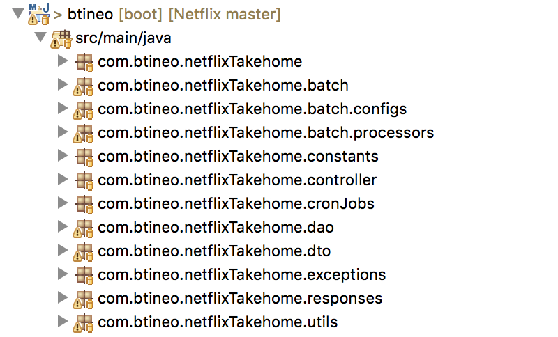
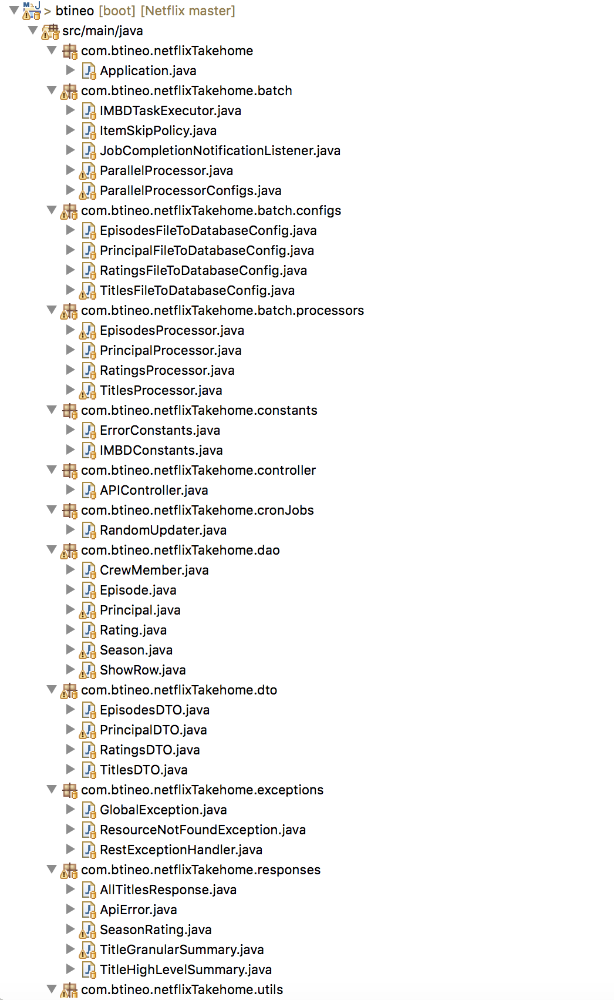

### Design / Architecture

A large portion of the process to build the APIs and build the processor to read in the TSV files are outlined in the other pages. This page is meant to provide some sketches of initial design ideas I had.

## Sketches
 These are initial sketches done before actual code develop. They don't reflect the final product as it evolved a lot during the actual implementation
 
 

## Project Anatomy

As can be seen below I tried to keep my project organized. Most of the Spring projects I have worked on at my current job actually come pre-packaged with another layer on top of Spring. As a result the project is dividng up into Maven submodules and the package structure is not translatable to a native Spring Rest application. As such every step of the way I tried to follow the Spring rest standards as I found them online.

Below is a more granular view of the files within each package

